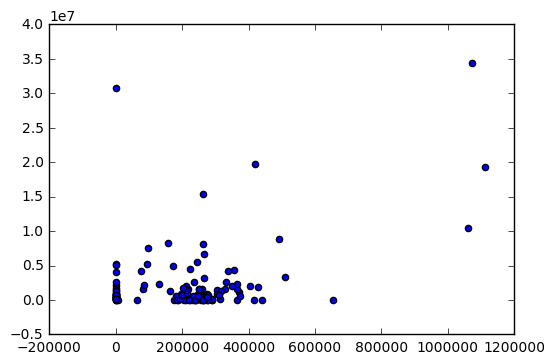
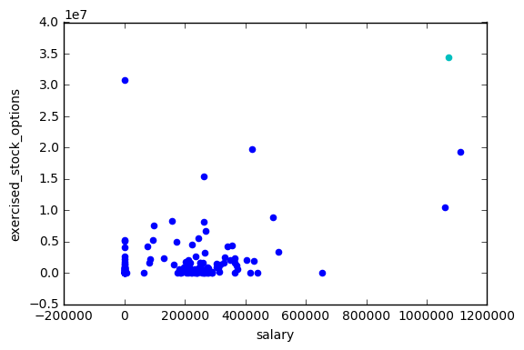
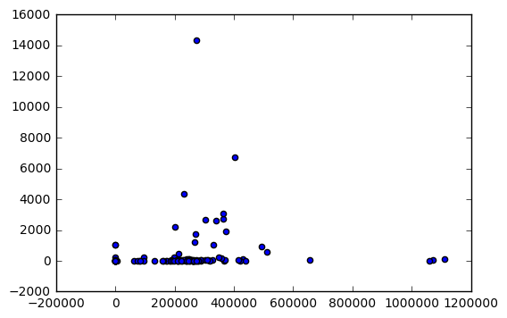
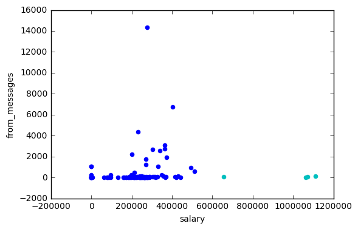

### Clustering

http://scikit-learn.org/stable/modules/clustering.html

In this project, we’ll apply k-means clustering to our Enron financial data. Our final goal, of course, is to identify persons of interest; since we have labeled data, this is not a question that particularly calls for an unsupervised approach like k-means clustering.

Nonetheless, you’ll get some hands-on practice with k-means in this project, and play around with feature scaling, which will give you a sneak preview of the next lesson’s material.

The starter code can be found in k_means/k_means_cluster.py, which reads in the email + financial (E+F) dataset and gets us ready for clustering. You’ll start with performing k-means based on just two financial features--take a look at the code, and determine which features the code uses for clustering.

Run the code, which will create a scatterplot of the data. Think a little bit about what clusters you would expect to arise if 2 clusters are created.


```python
#!/usr/bin/python

"""
    Skeleton code for k-means clustering mini-project.
"""


import pickle
import numpy
import matplotlib.pyplot as plt
import sys
sys.path.append("../tools/")
from feature_format import featureFormat, targetFeatureSplit


def Draw(pred, features, poi, mark_poi=False, name="image.png", f1_name="feature 1", f2_name="feature 2"):
    """ some plotting code designed to help you visualize your clusters """

    ### plot each cluster with a different color--add more colors for
    ### drawing more than five clusters
    colors = ["b", "c", "k", "m", "g"]
    for ii, pp in enumerate(pred):
        plt.scatter(features[ii][0], features[ii][1], color = colors[pred[ii]])

    ### if you like, place red stars over points that are POIs (just for funsies)
    if mark_poi:
        for ii, pp in enumerate(pred):
            if poi[ii]:
                plt.scatter(features[ii][0], features[ii][1], color="r", marker="*")
    plt.xlabel(f1_name)
    plt.ylabel(f2_name)
    plt.savefig(name)
    plt.show()


```


```python
data_dict[data_dict.keys()[0]]
```


    {'bonus': 600000,
     'deferral_payments': 'NaN',
     'deferred_income': 'NaN',
     'director_fees': 'NaN',
     'email_address': 'mark.metts@enron.com',
     'exercised_stock_options': 'NaN',
     'expenses': 94299,
     'from_messages': 29,
     'from_poi_to_this_person': 38,
     'from_this_person_to_poi': 1,
     'loan_advances': 'NaN',
     'long_term_incentive': 'NaN',
     'other': 1740,
     'poi': False,
     'restricted_stock': 585062,
     'restricted_stock_deferred': 'NaN',
     'salary': 365788,
     'shared_receipt_with_poi': 702,
     'to_messages': 807,
     'total_payments': 1061827,
     'total_stock_value': 585062}


```python
### load in the dict of dicts containing all the data on each person in the dataset
data_dict = pickle.load( open("../final_project/final_project_dataset.pkl", "r") )
### there's an outlier--remove it!
data_dict.pop("TOTAL", 0)

### the input features we want to use
### can be any key in the person-level dictionary (salary, director_fees, etc.)
feature_1 = "salary"
feature_2 = "exercised_stock_options"
poi  = "poi"
features_list = [poi, feature_1, feature_2]
data = featureFormat(data_dict, features_list )
poi, finance_features = targetFeatureSplit( data )


### in the "clustering with 3 features" part of the mini-project,
### you'll want to change this line to
### for f1, f2, _ in finance_features:
### (as it's currently written, the line below assumes 2 features)
for f1, f2 in finance_features:
    plt.scatter( f1, f2 )
plt.show()

### cluster here; create predictions of the cluster labels
### for the data and store them to a list called pred
from sklearn.cluster import KMeans
import numpy as np
clf = KMeans(n_clusters=2)
clf.fit(finance_features)
pred = clf.fit_predict(finance_features)

### rename the "name" parameter when you change the number of features
### so that the figure gets saved to a different file
try:
    Draw(pred, finance_features, poi, mark_poi=False, name="clusters.pdf", f1_name=feature_1, f2_name=feature_2)
except NameError:
    print "no predictions object named pred found, no clusters to plot"
```





I don't see how those clusters are right.

Add a third feature to features_list, “total_payments". Now rerun clustering, using 3 input features instead of 2 (obviously we can still only visualize the original 2 dimensions). Compare the plot with the clusterings to the one you obtained with 2 input features. Do any points switch clusters? How many? This new clustering, using 3 features, couldn’t have been guessed by eye--it was the k-means algorithm that identified it.

(You'll need to change the code that makes the scatterplot to accommodate 3 features instead of 2, see the comments in the starter code for instructions on how to do this.)


```python
### load in the dict of dicts containing all the data on each person in the dataset
data_dict = pickle.load( open("../final_project/final_project_dataset.pkl", "r") )
### there's an outlier--remove it!
data_dict.pop("TOTAL", 0)

### the input features we want to use
### can be any key in the person-level dictionary (salary, director_fees, etc.)
feature_1 = "salary"
feature_2 = "exercised_stock_options"
feature_3 = 'total_payments'
poi  = "poi"
features_list = [poi, feature_1, feature_2, feature_3]
data = featureFormat(data_dict, features_list )
poi, finance_features = targetFeatureSplit( data )


### in the "clustering with 3 features" part of the mini-project,
### you'll want to change this line to
### for f1, f2, _ in finance_features:
### (as it's currently written, the line below assumes 2 features)
for f1, f2, _ in finance_features:
    plt.scatter( f1, f2)
plt.show()

### cluster here; create predictions of the cluster labels
### for the data and store them to a list called pred
from sklearn.cluster import KMeans
import numpy as np
clf = KMeans(n_clusters=2)
clf.fit(finance_features)
pred = clf.fit_predict(finance_features)

### rename the "name" parameter when you change the number of features
### so that the figure gets saved to a different file
try:
    Draw(pred, finance_features, poi, mark_poi=False, name="clusters2.pdf", f1_name=feature_1, f2_name=feature_2)
except NameError:
    print "no predictions object named pred found, no clusters to plot"
```





4 points switched cluster.

In the next lesson, we’ll talk about feature scaling. It’s a type of feature preprocessing that you should perform before some classification and regression tasks. Here’s a sneak preview that should call your attention to the general outline of what feature scaling does.

What are the maximum and minimum values taken by the “exercised_stock_options” feature used in this example?

(NB: if you look at finance_features, there are some "NaN" values that have been cleaned away and replaced with zeroes--so while those might look like the minima, it's a bit deceptive because they're more like points for which we don't have information, and just have to put in a number. So for this question, go back to data_dict and look for the maximum and minimum numbers that show up there, ignoring all the "NaN" entries.)


```python
data_list = []
for key in data_dict.keys():
    if data_dict[key]['exercised_stock_options'] != 'NaN':
        data_list.append(data_dict[key]['exercised_stock_options'])
```


```python
max(data_list)
```


    34348384


```python
min(data_list)
```


    3285


What are the maximum and minimum values taken by “salary”?

(NB: same caveat as in the last quiz. If you look at finance_features, there are some "NaN" values that have been cleaned away and replaced with zeroes--so while those might look like the minima, it's a bit deceptive because they're more like points for which we don't have information, and just have to put in a number. So for this question, go back to data_dict and look for the maximum and minimum numbers that show up there, ignoring all the "NaN" entries.)


```python
data_list_s = []
for key in data_dict.keys():
    if data_dict[key]['salary'] != 'NaN':
        data_list_s.append(data_dict[key]['salary'])
```


```python
max(data_list_s)
```


    1111258


```python
min(data_list_s)
```


    477


The plot on the next slide shows the exact same clustering code that you just wrote, but in this example we applied feature scaling before performing the clustering.

We want you to compare the clustering with scaling (on the next slide) with the first clustering visualization you produced, when you used two features in your clustering algorithm.

Notice that now the range of the features has changed to [0.0, 1.0]. That's the only change we've made.

In the next lesson you’ll learn a lot more about what feature scaling means, but for now, just look at the effect on the clusters--which point(s) switch their associated cluster?

The image with feature scaling is saved in the folder.

### Rescaling Features

http://scikit-learn.org/stable/modules/preprocessing.html

Min/Max Rescaler Coding


```python
""" quiz materials for feature scaling clustering """

### FYI, the most straightforward implementation might
### throw a divide-by-zero error, if the min and max
### values are the same
### but think about this for a second--that means that every
### data point has the same value for that feature!  
### why would you rescale it?  Or even use it at all?
def featureScaling(arr):
    rescale = []
    for i in arr:
        new_i = float(i - min(arr))/float(max(arr)-min(arr))
        rescale.append(new_i)
    return rescale


# tests of your feature scaler--line below is input data
data = [115, 140, 175]
print featureScaling(data)

```

    [0.0, 0.4166666666666667, 1.0]


```python
#example

from sklearn.preprocessing import MinMaxScaler
import numpy

weights = numpy.array([[115.], [140.], [175.]])  #Each training point is an array. Need to be float.
scaler = MinMaxScaler()
rescaled_weight = scaler.fit_transform(weights)
rescaled_weight
```


    array([[ 0.        ],
           [ 0.41666667],
           [ 1.        ]])


SVM with RBF kernel and K-Means Clustering (both are affected by two dimensions)can be affected by feature rescaling . SVM is based on the radius/distance.

Decision Trees does not involve trade-off. Just gives vertical or horizontal lines. Linear Regression always has features and coefficients together.

Apply feature scaling to your k-means clustering code from the last lesson, on the “salary” and “exercised_stock_options” features (use only these two features).


```python
# rescale features

from sklearn.preprocessing import MinMaxScaler

scaler = MinMaxScaler()
rescaled_salary = scaler.fit_transform(salary)
rescaled_stock = scaler.fit_transform(exercised_stock_options)
```


```python
### the input features we want to use
### can be any key in the person-level dictionary (salary, director_fees, etc.)
feature_1 = "salary"
feature_2 = "exercised_stock_options"
poi  = "poi"
features_list = [poi, feature_1, feature_2]
data = featureFormat(data_dict, features_list )
poi, finance_features = targetFeatureSplit( data )

#finance_features is a list of arrays
feature1_list = []
feature2_list = []
for i in range(len(finance_features)):
    feature1_list.append(finance_features[i][0])
    feature2_list.append(finance_features[i][1])

new_list = []
for i in range(len(finance_features)):
    new_list.append([feature1_list[i],feature2_list[i]])
```


```python
from sklearn.preprocessing import MinMaxScaler
import numpy

new_array = numpy.array(new_list) #change the list into an array for the rescaling function
scaler = MinMaxScaler()
rescaled_feature = scaler.fit_transform(new_array)
```


```python
for f1, f2 in rescaled_feature:
    plt.scatter( f1, f2 )
plt.show()

### cluster here; create predictions of the cluster labels
### for the data and store them to a list called pred
from sklearn.cluster import KMeans
import numpy as np
clf = KMeans(n_clusters=2)
clf.fit(rescaled_feature)
pred = clf.fit_predict(rescaled_feature)

### rename the "name" parameter when you change the number of features
### so that the figure gets saved to a different file
try:
    Draw(pred, rescaled_feature, poi, mark_poi=False, name="clusters.pdf", f1_name=feature_1, f2_name=feature_2)
except NameError:
    print "no predictions object named pred found, no clusters to plot"
```


What would be the rescaled value of a "salary" feature that had an original value of $200,000, and an "exercised_stock_options" feature of $1 million? (Be sure to represent these numbers as floats, not integers!)

Note: $200,000 and $1 million are not actual values in the data.


```python
float(200000 - min(feature1_list))/float(max(feature1_list)-min(feature1_list))
```


    0.17997620714541537


```python
float(1000000 - min(feature2_list))/float(max(feature2_list)-min(feature2_list))
```


    0.02911345115974015


One could argue about whether rescaling the financial data is strictly necessary, perhaps we want to keep the information that a $100,000 salary and $40,000,000 in stock options are dramatically different quantities. What if we wanted to cluster based on “from_messages” (the number of email messages sent from a particular email account) and “salary”? Would feature scaling be unnecessary in this case, or critical?


```python
### the input features we want to use
### can be any key in the person-level dictionary (salary, director_fees, etc.)
feature_1 = "salary"
feature_2 = "from_messages"
poi  = "poi"
features_list = [poi, feature_1, feature_2]
data = featureFormat(data_dict, features_list )
poi, finance_features = targetFeatureSplit( data )


### in the "clustering with 3 features" part of the mini-project,
### you'll want to change this line to
### for f1, f2, _ in finance_features:
### (as it's currently written, the line below assumes 2 features)
for f1, f2 in finance_features:
    plt.scatter( f1, f2 )
plt.show()

### cluster here; create predictions of the cluster labels
### for the data and store them to a list called pred
from sklearn.cluster import KMeans
import numpy as np
clf = KMeans(n_clusters=2)
clf.fit(finance_features)
pred = clf.fit_predict(finance_features)

### rename the "name" parameter when you change the number of features
### so that the figure gets saved to a different file
try:
    Draw(pred, finance_features, poi, mark_poi=False, name="clusters3.pdf", f1_name=feature_1, f2_name=feature_2)
except NameError:
    print "no predictions object named pred found, no clusters to plot"
```








Emails typically number in the hundreds or low thousands, salaries are usually at least 1000x higher.
So it is also necessary to rescale the features in this case.
